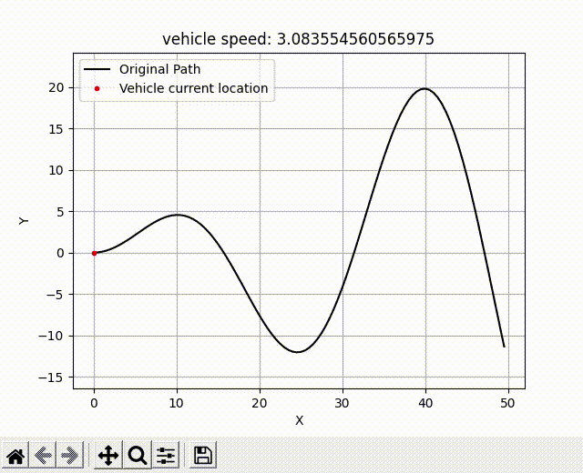

# Pure Pursuit + PID Algorithm
This repository contains a Python implementation of the Pure Pursuit algorithm combined with PID control for path tracking in autonomous vehicles. The algorithm allows a vehicle to follow a desired path by determining the steering commands based on the current vehicle position and the target point on the path.

## Algorithm Overview
The Pure Pursuit algorithm works by finding the target point on the desired path that is a fixed look-ahead distance away from the vehicle. The steering angle is then calculated based on this target point and the vehicle's current position. The PID control component provides control over the speed of the vehicle by adjusting the throttling commands based on the error between the current and desired velocity.

<p align="center">
    
</p>

## Features
1. **Interpolation**: In situations where there is no point exactly at the look-ahead distance, the algorithm performs linear interpolation between two points—one within the look-ahead distance and another outside the region. This interpolation ensures smooth and continuous tracking of the path.

2. **Adaptive Look-Ahead Distance**: The look-ahead distance can be dynamically adjusted based on the vehicle's speed. This adaptive approach helps in maintaining appropriate tracking performance at different speeds or conditions.

## Dependencies
To run the notebook, you need the following dependencies:
* Numpy
* Math
* matplotlib
* pandas
* shapely

## Usage
1. Import the required modules and classes from the repository into your own project:

```python
from pure_pursuit import pure_pursuit_PID
from generate_path import Path
```


3. Set up the desired path for the vehicle to follow, or generate it using generate_path function
```python
path = Path()
generated_path = path.generate_path().copy()
```

4. Call pure_pursuit_PID function to calculate velocity and theta at each point.
```python
final_data = pure_pursuit_PID(generated_path)
```

6. Plot orginal path and vehicle trajectory using plot_path function.
```python
path.plot_path(final_data)
```

8. Optionally, you can adjust look ahead distance, and other parameters by passing them to pure_pursuit_PID function.
